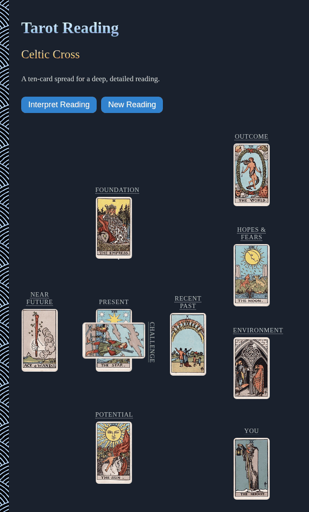

# Tarot-Reading

Draw a Celtic Cross tarot reading with the Rider-Waite-Smith deck, right in your browser. Turn the cards one by one, read what each one says about its place in the spread, then see the whole reading grouped by theme. No sign-up and no libraries.

- [Draw a tarot reading](https://evoluteur.github.io/tarot-reading/)
- [The 78 tarot cards](https://evoluteur.github.io/tarot-reading/tarot-cards/): one page per card, with its upright and shadow meanings



## What it does

The app lays out a **Celtic Cross**, the classic ten-card spread, and fills it in one of three ways:

- **Draw by Click**: the shuffled deck is fanned out on the page and you click cards to place them, one at a time.
- **Draw for Me**: the app deals the ten cards for you on a timer.
- **Enter Drawing**: for a reading you already did with a physical deck. Pick the ten cards from a form (a card can only be used once) and they appear on the spread as you choose them. Your entries are saved as you go.

Cards land face down. Click them one by one, in the order of the cross, to turn each over, or use **Reveal Cards** to turn them all in order. Click a card that is face up for its keywords, its meanings and a line of fortune telling, and click a position name to see what that position stands for.

Once every card is face up, **Interpret Reading** lays out the whole spread in four groups, each with the cards' keywords and first meaning, so the reading reads like a story instead of ten separate cards:

- **You & the Present**: Present and You.
- **The Throughline**: Foundation, Potential and Outcome.
- **The Immediate Path**: Recent Past, Challenge and Near Future.
- **The Outer Layer**: Environment and Hopes & Fears.

## The Celtic Cross

The ten positions, in the order they are dealt:

1. **Present**: the heart of the matter, what is happening right now.
2. **Challenge**: what crosses you, the tension or obstacle shaping the rest (shown lying across the first card).
3. **Foundation**: the root of the matter, an underlying influence from further back.
4. **Recent Past**: an influence that is fading.
5. **Potential**: the best that can be achieved, or the goal you are reaching for.
6. **Near Future**: what is coming next on the current path.
7. **You**: how you see yourself in this situation.
8. **Environment**: the people and circumstances around you.
9. **Hopes & Fears**: what you privately hope for and dread.
10. **Outcome**: where things are heading if the current path continues.

## The deck

All 78 cards of the Rider-Waite-Smith deck are included: the 22 Major Arcana and the four suits of the Minor Arcana (Wands, Cups, Swords and Pentacles, ten numbered cards and four court cards each). The card images are from the deck illustrated by Pamela Colman Smith in 1909 (published by Rider & Co., public domain), via [Wikipedia](https://en.wikipedia.org/wiki/Rider%E2%80%93Waite_Tarot).

The card meanings are adapted from Mark McElroy's [A Guide to Tarot Card Meanings](http://www.madebymark.com/a-guide-to-tarot-card-meanings/). A reading is a mirror for your own judgment, not a verdict.

## Card pages

Every card also has its own static page (`tarot-cards/the-fool.html` ... `tarot-cards/king-of-coins.html`), plus a page listing all 78 (`tarot-cards/index.html`), so each card can be found, shared and indexed on its own. They are generated from the same data as the app:

```
npm run build
```

This runs [scripts/build-card-pages.js](https://github.com/evoluteur/tarot-reading/blob/main/scripts/build-card-pages.js), which reads [js/tarot-data.js](https://github.com/evoluteur/tarot-reading/blob/main/js/tarot-data.js) (and the image names in js/tarot.js), and rewrites the pages, `sitemap.xml` and `robots.txt`. It only needs Node. Re-run it after editing the data and commit the result.

## How it is built

The app itself is plain HTML, CSS and JavaScript, with no dependencies and no build step. Just open `index.html`. (The only build step is the optional one above that regenerates the static card pages.)

- The card data (names, suits, ranks, keywords, meanings and fortune-telling lines) is in [js/tarot-data.js](https://github.com/evoluteur/tarot-reading/blob/main/js/tarot-data.js), and the app logic in [js/tarot.js](https://github.com/evoluteur/tarot-reading/blob/main/js/tarot.js).
- Three color themes (dark, light and blue) are shared with my other projects.
- Each visit starts a fresh reading: an empty Celtic Cross with the deck ready to draw from.

Tarot-Reading is open source at [GitHub](https://github.com/evoluteur/tarot-reading) with MIT license.

Had fun browsing the app? [Buy me a coffee by becoming a sponsor](https://github.com/sponsors/evoluteur).

You may also be interested in my other divination projects [I-Ching-Reading](https://github.com/evoluteur/i-ching-reading) ([demo](https://evoluteur.github.io/i-ching-reading/)), [Rune-Reading](https://github.com/evoluteur/rune-reading) ([demo](https://evoluteur.github.io/rune-reading/)), [Tibetan-Mo-Reading](https://github.com/evoluteur/tibetan-mo-reading) ([demo](https://evoluteur.github.io/tibetan-mo-reading/)) and [Motivational-Numerology](https://github.com/evoluteur/motivational-numerology) ([demo](https://evoluteur.github.io/motivational-numerology/)). For more mystic arts as small web apps, see [Esoterica](https://evoluteur.github.io/esoterica.html).

Copyright (c) 2026 [Olivier Giulieri](https://evoluteur.github.io/).
